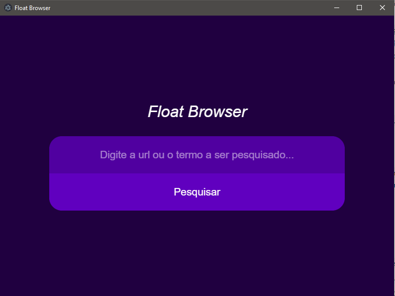

# Float Browser

Browser flutuante que permite carregar uma url e deixar em cima de das outras aplicações.



## Como utilizar

Para você conseguir utilizar o **Float Browser**, será necessário ter o node instalado e depois rodar os seguintes comandos:

```
  git clone https://github.com/claudioalberto/float-browser.git
  cd float-browser
  npm install
  npm start
```
